# SynapseFlow — Complete Codebase Guide for AI Agents

> This document is a comprehensive, file-by-file technical reference for an AI agent or developer who needs to understand, modify, or extend the SynapseFlow codebase. It covers every file, every interface, every data flow, and every implicit behavior.

---

## Table of Contents

- [1. Project Identity](#1-project-identity)
- [2. Technology Stack & Dependencies](#2-technology-stack--dependencies)
- [3. Application Architecture](#3-application-architecture)
- [4. File-by-File Reference](#4-file-by-file-reference)
  - [4.1 Configuration Files](#41-configuration-files)
  - [4.2 Entry Points](#42-entry-points)
  - [4.3 Design System (CSS)](#43-design-system-css)
  - [4.4 Data Layer — lib/](#44-data-layer--lib)
  - [4.5 State Management — stores/](#45-state-management--stores)
  - [4.6 Simulation Engine — hooks/](#46-simulation-engine--hooks)
  - [4.7 Layout Components](#47-layout-components)
  - [4.8 Agent Components](#48-agent-components)
  - [4.9 Workflow Components](#49-workflow-components)
  - [4.10 Activity Components](#410-activity-components)
  - [4.11 Analytics Components](#411-analytics-components)
  - [4.12 Templates Components](#412-templates-components)
- [5. Data Models & Interfaces](#5-data-models--interfaces)
- [6. State Management Deep Dive](#6-state-management-deep-dive)
- [7. Application Lifecycle & Initialization](#7-application-lifecycle--initialization)
- [8. View Routing System](#8-view-routing-system)
- [9. Simulation Engine Details](#9-simulation-engine-details)
- [10. Mock Data System](#10-mock-data-system)
- [11. Styling Conventions](#11-styling-conventions)
- [12. Animation Patterns](#12-animation-patterns)
- [13. Key Modification Points](#13-key-modification-points)
- [14. Known Limitations & Gotchas](#14-known-limitations--gotchas)
- [15. Dependency Graph](#15-dependency-graph)

---

## 1. Project Identity

- **Name**: SynapseFlow
- **Type**: Frontend-only Single Page Application (SPA)
- **Purpose**: Visual AI agent swarm management dashboard (FYP prototype)
- **Status**: Phase 1 MVP complete — all data is simulated/mocked client-side
- **No backend**: No API server, no database, no real LLM calls, no authentication server
- **Framework**: Next.js 16 with App Router (but used as a client-rendered SPA — the only page is `page.tsx`, which is marked `'use client'`)

---

## 2. Technology Stack & Dependencies

### Runtime Dependencies

| Package | Version | Purpose |
|---|---|---|
| `next` | 16.2.6 | React framework, App Router, dev server |
| `react` / `react-dom` | 19.2.4 | UI rendering |
| `zustand` | ^5.0.13 | Lightweight state management (4 stores) |
| `@xyflow/react` | ^12.10.2 | Interactive node-graph canvas for workflows |
| `framer-motion` | ^12.40.0 | Declarative animations and transitions |
| `recharts` | ^3.8.1 | Chart library for analytics (Bar, Area, Line charts) |
| `lucide-react` | ^1.16.0 | Icon library (SVG icons as React components) |
| `clsx` | ^2.1.1 | Conditional CSS class merging |
| `tailwind-merge` | ^3.6.0 | Intelligent Tailwind class deduplication |
| `class-variance-authority` | ^0.7.1 | Variant-based component styling (imported but sparingly used) |

### Dev Dependencies

| Package | Version | Purpose |
|---|---|---|
| `tailwindcss` | ^4 | Utility-first CSS framework |
| `@tailwindcss/postcss` | ^4 | PostCSS plugin for Tailwind |
| `typescript` | ^5 | Type safety |
| `eslint` + `eslint-config-next` | ^9 / 16.2.6 | Linting |

### Key Insight for Agents

The project uses **TailwindCSS 4** (not v3). Tailwind v4 uses CSS-based configuration rather than `tailwind.config.js`. The configuration is embedded in `globals.css` via `@import "tailwindcss"`. There is no `tailwind.config.js` or `tailwind.config.ts` file.

---

## 3. Application Architecture

### High-Level Flow

```
Browser loads localhost:3000
  → Next.js serves layout.tsx (server component)
    → Renders page.tsx (client component — 'use client')
      → Checks isAuthenticated (uiStore)
        → FALSE: Render login screen (no real auth — any creds work)
        → TRUE:  Render main dashboard shell
          → Sidebar (fixed left, nav buttons)
          → TopBar (fixed top, search/status)
          → Main content area (view router via currentView)
          → ContextPanel (fixed right, togglable)
          → AgentCreator modal (overlay)
      → On mount: initializes all 4 Zustand stores
      → Starts useAgentSimulation hook (2-second interval loop)
```

### Rendering Model

This is a **fully client-side app** despite using Next.js App Router. The root `page.tsx` is marked `'use client'`, so there are no Server Components, no SSR data fetching, no API routes, and no server-side logic. Next.js essentially acts as a dev server and bundler.

### State Architecture

```
┌─────────────────────────────────────────────────────────────┐
│                     Zustand Stores                          │
│                                                             │
│  ┌──────────────┐  ┌────────────────┐  ┌────────────────┐  │
│  │  agentStore   │  │ workflowStore  │  │ activityStore  │  │
│  │              │  │                │  │                │  │
│  │ agents[]     │  │ nodes[]        │  │ activities[]   │  │
│  │ selectedId   │  │ edges[]        │  │ maxActivities  │  │
│  │              │  │ isExecuting    │  │                │  │
│  │ CRUD ops     │  │ executingIds   │  │ add/set/clear  │  │
│  └──────┬───────┘  └────────┬───────┘  └────────┬───────┘  │
│         │                   │                    │          │
│  ┌──────┴───────────────────┴────────────────────┴───────┐  │
│  │                      uiStore                          │  │
│  │                                                       │  │
│  │ currentView | sidebarCollapsed | contextPanelOpen     │  │
│  │ isBeginnerMode | searchQuery | isAuthenticated        │  │
│  │ notifications[]                                       │  │
│  └───────────────────────────────────────────────────────┘  │
└─────────────────────────────────────────────────────────────┘
          │                   │                    │
          ▼                   ▼                    ▼
┌─────────────────────────────────────────────────────────────┐
│              React Component Tree (reads stores)            │
│                                                             │
│  page.tsx → Sidebar, TopBar, ContextPanel, AgentGrid,       │
│             WorkflowCanvas, AnalyticsDashboard,             │
│             TemplatesGallery, AgentCreator                  │
└─────────────────────────────────────────────────────────────┘
          ▲
          │
┌─────────────────────┐
│  useAgentSimulation  │  ← setInterval every 2s
│  (writes to stores)  │     randomly mutates agent state
└─────────────────────┘
```

---

## 4. File-by-File Reference

### 4.1 Configuration Files

#### `package.json`
- **Scripts**: `dev` (next dev), `build` (next build), `start` (next start), `lint` (eslint)
- **No test script** exists
- **No custom scripts** for deployment

#### `tsconfig.json`
- Uses `@/` path alias mapping to `./src/`
- Strict mode enabled
- JSX set to `preserve` (handled by Next.js)

#### `next.config.ts`
- Minimal config, no custom webpack, no rewrites, no redirects

#### `postcss.config.mjs`
- Single plugin: `@tailwindcss/postcss`

#### `eslint.config.mjs`
- Extends `eslint-config-next` with default rules

---

### 4.2 Entry Points

#### `src/app/layout.tsx` — Root Layout (Server Component)

**Role**: Wraps all pages with HTML structure, fonts, and global CSS.

**Key details**:
- Loads **Geist** (sans) and **Geist_Mono** (monospace) fonts from `next/font/google`
- Sets CSS custom properties `--font-geist-sans` and `--font-geist-mono` on `<html>`
- Adds `antialiased` class for font rendering
- Sets page metadata: title = "SynapseFlow — Visual AI Swarm OS"
- Imports `globals.css` which contains the entire design system

**This is the ONLY server component in the app.** Everything else is `'use client'`.

---

#### `src/app/page.tsx` — Main Page (Client Component, 417 lines)

**Role**: The entire application lives in this single file. It handles:

1. **Authentication gate** (lines 259–384):
   - Renders a full-screen login page with animated background shapes
   - Pre-fills demo credentials: `admin@synapseflow.ai` / `password123`
   - `handleLogin` is a fake multi-step animation (`setInterval` cycling through status messages)
   - "Biometric bypass" button triggers the same fake login
   - `isAuthenticated` is a Zustand boolean — no tokens, no sessions

2. **Store initialization** (lines 73–86):
   - `useEffect` on mount calls `initializeAgents()` and `initializeWorkflow()`
   - Second `useEffect` watches `agents.length > 0` then calls `initializeActivities(agents)`
   - `useAgentSimulation()` hook starts the 2-second simulation loop

3. **View routing** (lines 92–257):
   - `renderContentView()` switches on `currentView` from uiStore
   - Views: `dashboard`, `agents`, `workflows`, `workflow-canvas`, `analytics`, `templates`, `settings`
   - `dashboard` view renders hero stat cards + AgentGrid
   - `settings` view renders inline API key inputs, simulation speed slider, sound toggle, system safety button

4. **Main layout** (lines 387–416):
   - Three-column layout: Sidebar (fixed left) | Main Content (flexible center) | ContextPanel (fixed right, togglable)
   - `paddingLeft` dynamically adjusts based on `sidebarCollapsed`
   - `paddingRight` dynamically adjusts based on `contextPanelOpen`

**Local state** (not in Zustand):
- `isSpawnModalOpen` — controls AgentCreator modal
- `loginEmail`, `loginPassword`, `isLoggingIn`, `loginStep` — login form
- `openaiKey`, `anthropicKey`, `simulationSpeed`, `soundEffects` — settings (never persisted or used)

---

### 4.3 Design System (CSS)

#### `src/app/globals.css` (~7300 bytes)

**Role**: Complete design system via CSS custom properties and utility classes.

**Key CSS custom properties**:
```css
--bg-primary: #0a0a0f          /* Main background (near-black) */
--bg-secondary: #12121a        /* Card backgrounds */
--bg-elevated: #1a1a28         /* Input backgrounds, elevated surfaces */
--bg-hover: #22222e            /* Hover states */
--text-primary: #f0f0f5        /* Main text (near-white) */
--text-secondary: #a0a0b5      /* Secondary text */
--text-tertiary: #65657a       /* Muted text */
--accent-purple: #8b5cf6       /* Primary accent */
--accent-cyan: #06b6d4         /* Secondary accent */
--border-subtle: rgba(255,255,255,0.06)  /* Borders */
--sidebar-width: 260px         /* Expanded sidebar */
--sidebar-collapsed: 72px      /* Collapsed sidebar */
--context-panel-width: 340px   /* Right panel */
--font-heading: 'Geist', ...   /* Heading font */
--font-sans: 'Geist', ...      /* Body font */
--font-mono: 'Geist Mono', ... /* Code font */
```

**Custom classes**:
- `.glass` — Glassmorphic panel: semi-transparent background + backdrop blur + subtle border
- `.glass-strong` — Heavier glassmorphism for modals
- `.gradient-text` — Purple-to-cyan gradient text via `background-clip: text`
- `.typing-indicator` — Three-dot bouncing animation (CSS-only)
- `@keyframes shimmer` — Progress bar shine effect
- `@keyframes fadeInUp` — Entry animation

**Custom scrollbar** styles are defined for dark theme.

---

### 4.4 Data Layer — lib/

#### `src/lib/constants.ts` (177 lines)

**Role**: Central source of truth for all enums, type definitions, and static configuration.

**Exports**:

1. **`AGENT_STATUSES`** — Readonly tuple: `['idle', 'thinking', 'researching', 'writing', 'waiting', 'collaborating', 'reviewing', 'error', 'completed']`

2. **`AgentStatus`** — TypeScript type derived from the tuple above

3. **`STATUS_CONFIG`** — Record mapping each status to `{ color, label, bgColor, glowColor }`:
   - `idle` → gray (#6b7280)
   - `thinking` → purple (#a855f7)
   - `researching` → blue (#3b82f6)
   - `writing` → cyan (#06b6d4)
   - `waiting` → amber (#f59e0b)
   - `collaborating` → cyan (#06b6d4)
   - `reviewing` → orange (#f97316)
   - `error` → red (#ef4444)
   - `completed` → green (#22c55e)

4. **`AGENT_ROLES`** — `['Researcher', 'Writer', 'Planner', 'Reviewer', 'Coder', 'Designer', 'Analyst', 'Coordinator', 'Debugger', 'Summarizer']`

5. **`AGENT_AVATARS`** — Emoji array: `['🧠', '✍️', '🔍', '📊', '💻', '🎨', '📋', '🔗', '🛡️', '⚡']`

6. **`AGENT_TOOLS`** — `['Web Search', 'Code Interpreter', 'File Reader', 'API Caller', 'Email Sender', 'Database Query', 'Browser', 'Calculator', 'Image Generator', 'Text Analyzer']`

7. **`WORKFLOW_NODE_TYPES`** — `['agent', 'approval', 'apiCall', 'condition', 'delay', 'database', 'webScraper', 'email', 'memory', 'fileProcessor']`
   - **Note**: Only `agent`, `approval`, and `condition` are actually implemented as React components

8. **`ACTIVITY_TYPES`** — `['task_started', 'task_completed', 'thinking', 'tool_call', 'message_sent', 'error', 'delegation', 'output_ready', 'approval_needed', 'collaboration']`

9. **`ACTIVITY_MESSAGES`** — Record mapping each activity type to an array of 3–5 sample message strings (used by the simulation engine to generate random events)

10. **`TEMPLATE_PRESETS`** — Array of 8 preset objects, each with `{ id, name, description, icon, agents, category, color }`

---

#### `src/lib/mock-data.ts` (259 lines)

**Role**: Type definitions and factory functions for generating mock data.

**Interface Exports**:

1. **`Agent`** — The core agent interface:
   ```typescript
   {
     id: string;
     name: string;
     avatar: string;          // Emoji character
     role: string;            // From AGENT_ROLES
     status: AgentStatus;     // From AGENT_STATUSES
     currentTask: string;     // Human-readable task description
     progress: number;        // 0–100
     tokensUsed: number;      // Cumulative token counter
     timeSpent: number;       // Seconds
     activeTools: string[];   // From AGENT_TOOLS
     lastOutput: string;      // Most recent output text
     health: 'good' | 'warning' | 'critical';
     model: string;           // LLM model name (e.g. 'GPT-4o')
     memory: string[];        // Context entries
     personality: string;     // Behavioral description
     goal: string;            // Primary objective
   }
   ```

2. **`ActivityEvent`** — Activity feed item:
   ```typescript
   {
     id: string;
     agentId: string;
     agentName: string;
     agentAvatar: string;
     type: string;            // From ACTIVITY_TYPES
     message: string;
     timestamp: Date;
     details?: string;        // Optional extra info (unused)
   }
   ```

3. **`WorkflowTemplate`** — Template metadata (defined but only used via TEMPLATE_PRESETS)

**Function Exports**:

1. **`createMockAgents(): Agent[]`** — Returns array of 8 hardcoded agents:
   - Atlas (🧠 Planner, GPT-4o, thinking)
   - Nova (🔍 Researcher, Claude Sonnet, researching)
   - Quill (✍️ Writer, GPT-4o, writing)
   - Sentinel (🛡️ Reviewer, Gemini Pro, reviewing, health='warning')
   - Pixel (🎨 Designer, DALL-E 3, idle)
   - Cipher (💻 Coder, Claude Sonnet, thinking)
   - Nexus (🔗 Coordinator, GPT-4o Mini, collaborating)
   - Spark (⚡ Analyst, Gemini Pro, completed, progress=100)

2. **`createMockActivities(agents: Agent[]): ActivityEvent[]`** — Generates 14 pre-scripted events with relative timestamp offsets (in seconds before "now"). References agents by array index.

**Unused constants** defined locally: `TASK_DESCRIPTIONS` and `LAST_OUTPUTS` arrays exist in the file but are not referenced anywhere.

---

#### `src/lib/utils.ts` (31 lines)

**Role**: Small utility functions.

**Exports**:
- `cn(...inputs)` — Combines clsx + tailwind-merge for class name composition
- `formatTime(seconds)` — Converts seconds to human-readable string: `45` → `"45s"`, `180` → `"3m 0s"`, `3700` → `"1h 1m"`
- `formatTokens(count)` — Formats numbers: `500` → `"500"`, `12500` → `"12.5K"`, `1200000` → `"1.20M"`
- `randomBetween(min, max)` — Random integer in range (inclusive)
- `randomItem(arr)` — Random element from array
- `generateId()` — Creates unique ID: `"${Date.now()}-${random9chars}"`

---

### 4.5 State Management — stores/

All stores use Zustand v5 `create()`. No middleware (no persist, no devtools). State resets on page refresh.

#### `src/stores/agentStore.ts` (51 lines)

**State**:
- `agents: Agent[]` — Array of all agents (initially `[]`, populated by `initializeAgents`)
- `selectedAgentId: string | null` — Currently selected agent for ContextPanel display

**Actions**:
- `setAgents(agents)` — Replace entire array (used by template deployment)
- `updateAgent(id, updates)` — Partial update of a single agent by ID (used by simulation)
- `addAgent(agent)` — Push new agent (used by AgentCreator)
- `removeAgent(id)` — Remove agent and deselect if selected
- `selectAgent(id)` — Set selected agent ID
- `getSelectedAgent()` — Derived getter (uses `get()`)
- `initializeAgents()` — Calls `createMockAgents()` and sets the result

---

#### `src/stores/workflowStore.ts` (100 lines)

**State**:
- `nodes: Node[]` — React Flow nodes (initially `[]`)
- `edges: Edge[]` — React Flow edges (initially `[]`)
- `selectedNodeId: string | null` — Currently selected workflow node
- `isExecuting: boolean` — Whether workflow is "running" (visual-only toggle)
- `executingNodeIds: string[]` — IDs of nodes currently executing (unused in rendering)

**Hardcoded defaults** (`DEFAULT_NODES` and `DEFAULT_EDGES`):
- 7 nodes: 5 `agentNode`, 1 `approvalNode`, 1 `conditionNode`
- 8 edges with colored strokes and animated flag
- Represents: Research → Writer + Analyst → Human Review → Quality Check → Publisher or Reviser (with retry loop)

**Actions**:
- `setNodes`, `setEdges` — Replace entire arrays
- `addNode`, `removeNode` — CRUD (removeNode also removes connected edges)
- `selectNode` — Set selected node ID
- `setIsExecuting`, `setExecutingNodeIds` — Execution state
- `onNodesChange`, `onEdgesChange` — **Empty no-op functions** (React Flow change handlers that don't persist changes to the store — the canvas manages its own internal state via `useNodesState`/`useEdgesState`)
- `initializeWorkflow()` — Sets nodes and edges to hardcoded defaults

**Important**: The store's `onNodesChange`/`onEdgesChange` are intentionally empty. The `WorkflowCanvas` component uses React Flow's own `useNodesState`/`useEdgesState` hooks for local canvas state, syncing from the store only on initialization.

---

#### `src/stores/activityStore.ts` (32 lines)

**State**:
- `activities: ActivityEvent[]` — Activity feed events (newest first)
- `maxActivities: number` — Cap at 100 events

**Actions**:
- `addActivity(activity)` — Prepend to array, slice to max
- `setActivities(activities)` — Replace all
- `clearActivities()` — Empty the array
- `initializeActivities(agents)` — Calls `createMockActivities(agents)` and reverses (newest first)

---

#### `src/stores/uiStore.ts` (52 lines)

**State**:
- `sidebarCollapsed: boolean` — Default `false` (expanded)
- `contextPanelOpen: boolean` — Default `false` (hidden)
- `currentView` — Union type: `'dashboard' | 'agents' | 'workflows' | 'workflow-canvas' | 'analytics' | 'templates' | 'settings'` — Default `'dashboard'`
- `isBeginnerMode: boolean` — Default `true` (toggled via TopBar, purely cosmetic label change)
- `searchQuery: string` — Shared search text (used by AgentGrid filter)
- `notifications: Notification[]` — Array of `{ id, type, message, timestamp, read }`
- `isAuthenticated: boolean` — Default `false`

**Actions**: Standard setters, togglers, and an `addNotification` method.

---

### 4.6 Simulation Engine — hooks/

#### `src/hooks/useAgentSimulation.ts` (126 lines)

**Role**: The heartbeat of the application. Makes the dashboard feel "alive" by randomly mutating agent data every 2 seconds.

**How it works**:

1. Runs a `setInterval` every **2000ms**
2. Each tick picks a **random agent** from `agents[]`
3. Generates a random number `updateType` between 0 and 1, then:

| Probability | Action | Details |
|---|---|---|
| 0–0.3 (30%) | **Change status** | Picks random status from ALL_STATUSES, sets matching task message and random progress |
| 0.3–0.6 (30%) | **Update progress** | Increments by 1–8%, auto-completes at 100% |
| 0.6–0.8 (20%) | **Increment tokens** | Adds 50–500 tokens and 1–5 seconds (only for active agents) |
| 0.8–1.0 (20%) | **Generate tool call** | Adds a tool_call activity event (only for active agents with tools) |

4. Status changes also generate corresponding activity events via `addActivity()`
5. The interval only fires if `agents.length > 0`
6. Cleanup on unmount via `clearInterval`

**Dependency**: `[agents.length]` — re-creates the interval only when agent count changes. This means the hook captures a stale `agents` reference for individual agent reads, but since it uses `randomBetween(0, agents.length - 1)` and the store getter, this is safe.

---

### 4.7 Layout Components

#### `src/components/layout/Sidebar.tsx` (159 lines)

**Role**: Fixed left navigation panel with collapse animation.

**Behavior**:
- Width animates between 260px (expanded) and 72px (collapsed) via Framer Motion
- Contains 6 nav items: Dashboard, Agents, Workflows, Analytics, Templates, Settings
- Active item has a purple left-border pill animated via `layoutId="sidebar-active"` (shared layout animation)
- Labels fade in/out with `AnimatePresence` based on collapsed state
- Bottom section shows "AI System Active" badge with count of active agents
- Collapse/expand toggle button at very bottom

**Reads**: `uiStore` (sidebarCollapsed, currentView, setCurrentView), `agentStore` (agents — to count active)

---

#### `src/components/layout/TopBar.tsx` (142 lines)

**Role**: Fixed top header bar with search, status indicators, and action buttons.

**Contains**:
- Search input (writes to `uiStore.searchQuery`, used by AgentGrid filtering)
- ⌘K keyboard shortcut indicator (visual only, no actual handler)
- Pulsing green "Live" badge (animated opacity)
- Active agents count
- Token total (responsive — hidden on mobile via `hidden md:flex`)
- Beginner/Advanced mode toggle (cosmetic label swap only)
- Notification bell with hardcoded "3" badge (not connected to real notifications)
- Context panel toggle button

**Positioning**: Uses `left: sidebarCollapsed ? 72 : 260` for responsive offset.

---

#### `src/components/layout/ContextPanel.tsx` (188 lines)

**Role**: Fixed right sidebar that shows either agent details or the activity feed.

**Two modes**:

1. **Agent selected** (`selectedAgentId !== null`): Shows detailed agent profile:
   - Large avatar with glow effect
   - Name, role, status with color coding
   - Current task description
   - 4 stat cards: Tokens, Time, Model, Health
   - Active tools list
   - Memory entries
   - Personality and Goal text
   - ThinkingStream component (if agent is in active status)
   - Last output preview

2. **No agent selected**: Shows the `<ActivityFeed />` component

**Animation**: Slides in from right (x: 340 → 0) via Framer Motion `AnimatePresence`.

---

### 4.8 Agent Components

#### `src/components/agents/AgentCard.tsx` (229 lines)

**Role**: Individual agent card rendered in the grid. Shows real-time status.

**Visual features**:
- Framer Motion entrance animation (staggered by index)
- Hover lift effect (`y: -3`)
- Status-colored border glow when selected
- Pulsing background overlay for active agents
- Animated status ring around avatar for non-idle agents
- Health indicator dot (green/amber/red)
- Status badge pill with pulsing dot
- Animated progress bar with shimmer effect
- Active tools as small pills
- Stats row: tokens + time
- Hover-reveal action buttons (Pause, View)
- Typing indicator (three bouncing dots) for thinking/writing agents
- Last output preview in italics

**onClick**: Calls `selectAgent(agent.id)` to select in agentStore.

---

#### `src/components/agents/AgentGrid.tsx` (155 lines)

**Role**: Filterable grid container for AgentCards.

**Filtering**:
- **Search**: Filters by name, role, or currentTask (case-insensitive)
- **Status dropdown**: All | Active Only | individual statuses
- **Role dropdown**: All | individual roles from AGENT_ROLES
- **Clear filters** button appears when any filter is active

**Layout**: Responsive grid: 1 col → 2 → 3 → 4 columns

**Empty state**: Centered icon with "No Agents Found" message.

**Props**: `onSpawnClick?: () => void` — callback to open AgentCreator modal. Renders "Spawn Agent" button with gradient background.

---

#### `src/components/agents/AgentCreator.tsx` (421 lines)

**Role**: Full-featured modal form for creating new agents.

**Form fields**:
- **Role** — Select dropdown from AGENT_ROLES
- **Auto-Fill Preset Details** — Button that populates name, avatar, goal, personality, and tools based on selected role (uses hardcoded lookup maps for all 10 roles)
- **Agent Name** — Text input (required)
- **Avatar** — Emoji picker row from AGENT_AVATARS
- **LLM Model** — 4 toggle buttons: GPT-4o, Claude Sonnet, Gemini Pro, GPT-4o Mini
- **Core Goal** — Textarea
- **Personality** — Text input
- **Tools** — Toggle pill buttons from AGENT_TOOLS (multi-select)

**Submit behavior**:
1. Creates Agent object with `status: 'idle'`, `progress: 0`, `tokensUsed: 0`
2. Calls `addAgent(newAgent)` on agentStore
3. Adds a `task_started` activity event
4. Closes modal and resets form

**Animation**: Modal scales in/out with Framer Motion. Backdrop blur on overlay.

---

### 4.9 Workflow Components

#### `src/components/workflow/WorkflowCanvas.tsx` (165 lines)

**Role**: React Flow–powered interactive node graph canvas.

**Setup**:
- Registers 3 custom node types: `agentNode`, `approvalNode`, `conditionNode`
- Uses React Flow's `useNodesState` and `useEdgesState` for local canvas state
- Syncs from workflowStore on initial load and when defaults change
- `onConnect` callback adds new edges with purple stroke and animation

**Toolbar** (top-left overlay):
- Run/Stop toggle button (green/red)
- Reset button (visual only, no handler)
- Add node button (visual only, no handler)

**Execution indicator** (top-right): Pulsing green badge when `isExecuting` is true.

**Canvas features**:
- Dot-pattern background
- Controls (zoom in/out/fit)
- MiniMap (bottom-right)
- `fitView` with 0.3 padding on load

---

#### `src/components/workflow/WorkflowsList.tsx` (210 lines)

**Role**: List view of workflow pipelines with actions.

**Displays 3 hardcoded pipelines**:
1. "Default Collaborative Swarm" — the active/editable one (reads real node/edge counts from store)
2. "Customer Feedback Sentiment Flow" — static display only
3. "SEO Page Analyzer Pipeline" — static display only

**Actions**:
- **Run/Stop Pipeline** — toggles `isExecuting` on workflowStore
- **Open Canvas** — navigates to `workflow-canvas` view
- **Create Empty Pipeline** — clears nodes/edges and opens canvas
- **Load into Swarm** — re-initializes default workflow and opens canvas

---

#### `src/components/workflow/nodes/AgentNode.tsx` (83 lines)

**Role**: Custom React Flow node for agents.

**Visual**: Dark card with avatar, label, role, and pulsing status indicator. Status color from STATUS_CONFIG.

**Handles**: Left (target) and Right (source) connection handles with colored borders.

**Data interface**: `{ label: string, status: AgentStatus, avatar: string, role: string }`

**Memo'd** with `React.memo` for performance.

---

#### `src/components/workflow/nodes/ApprovalNode.tsx` (72 lines)

**Role**: Human approval gate node in workflow canvas.

**Visual**: Amber/yellow themed card with UserCheck icon. Always shows "Awaiting Approval" with pulsing dot.

**Data interface**: `{ label: string, status?: string }`

---

#### `src/components/workflow/nodes/ConditionNode.tsx` (81 lines)

**Role**: Conditional branching node in workflow canvas.

**Visual**: Purple-themed card with GitBranch icon. Shows condition expression in monospace font (e.g., `if (score > 85)`).

**Handles**: 1 target (left), 2 sources (right) — "pass" at 35% height (green) and "fail" at 65% height (red).

**Data interface**: `{ label: string, condition?: string }`

---

### 4.10 Activity Components

#### `src/components/activity/ActivityFeed.tsx` (128 lines)

**Role**: Scrollable list of activity events with type-based icons and relative timestamps.

**Icon mapping** (`ACTIVITY_ICONS`): Maps each of the 10 activity types to a Lucide icon and color.

**Features**:
- Live green dot indicator at top
- Event count badge
- Auto-scroll to top when new events are added
- Each event shows: type icon, agent avatar + name, message, relative timestamp
- Hover highlight on items
- Framer Motion `AnimatePresence` for smooth item entry/exit
- Empty state with Brain icon

**Time formatting**: `getTimeAgo()` helper converts timestamps to "just now", "30s ago", "5m ago", "2h ago".

---

#### `src/components/activity/ThinkingStream.tsx` (101 lines)

**Role**: Simulated "chain-of-thought" reasoning log for active agents. Shows in ContextPanel.

**Behavior**:
1. On mount (or agent ID change), initializes with 4 system log lines:
   - `[sys] Initialized cognitive query context for {name}`
   - `[model] Selected brain: {model}`
   - `[personality] Loaded behavioral bias: {personality}`
   - `[objective] Pursuing goal: "{goal}"`
2. Then sequentially adds 7 simulated thinking steps with random delays (800–2800ms):
   - "Recalling context parameters from memory vector space..."
   - "Extracting relevant semantic associations..."
   - "Structuring reasoning outline using Tree-of-Thought search..."
   - etc.
3. Final line: `[ready] Swarm update dispatch complete.`

**Styling**: Monospace font, dark background, color-coded prefixes ([sys] = tertiary, [model] = cyan, [ready] = green, Tree-of-Thought = purple).

---

### 4.11 Analytics Components

#### `src/components/analytics/AnalyticsDashboard.tsx` (170 lines)

**Role**: Charts and statistics view. All data is **hardcoded**.

**6 stat cards** (all static values):
- Tasks Completed: 346 (+12%)
- Active Agents: 8 (+2)
- Tokens Used: 1.2M (+8%)
- Avg Response: 2.4s (-15%)
- Total Cost: $14.28 (+5%)
- Error Rate: 2.1% (-0.5%)

**2 charts** (Recharts):
1. **Tasks Completed** — Bar chart (7 days, Mon–Sun), completed vs failed tasks, purple + red bars
2. **Token Usage** — Area chart (hourly, 00:00–23:59), cyan with gradient fill

Both use custom tooltip component with dark theme.

---

### 4.12 Templates Components

#### `src/components/templates/TemplatesGallery.tsx` (484 lines)

**Role**: Gallery of pre-built swarm configurations that can be one-click deployed.

**Category filter**: All, Research, Marketing, Support, Engineering, Sales

**Displays**: Cards from `TEMPLATE_PRESETS` (8 templates) with icon, name, description, agent count, deploy button.

**Deploy behavior** (`handleDeployTemplate`):
- Has full implementations for 2 templates: `research-team` (4 agents, 5 nodes, 5 edges) and `coding-team` (4 agents, 6 nodes, 6 edges)
- All other templates use a generic fallback (2 agents, 2 nodes, 1 edge)
- On deploy:
  1. Replaces all agents in agentStore
  2. Replaces all nodes/edges in workflowStore
  3. Clears activity feed and adds a system deployment event
  4. Adds a success notification
  5. Navigates to dashboard view

---

## 5. Data Models & Interfaces

### Agent

| Field | Type | Description | Mocked? |
|---|---|---|---|
| id | string | Unique ID via `generateId()` | Generated |
| name | string | Display name (e.g., "Atlas") | Hardcoded |
| avatar | string | Single emoji character | Hardcoded |
| role | string | From AGENT_ROLES | Hardcoded |
| status | AgentStatus | 9-value union type | Simulated (2s interval) |
| currentTask | string | Human-readable description | Simulated |
| progress | number | 0–100 | Simulated |
| tokensUsed | number | Cumulative counter | Simulated (increments) |
| timeSpent | number | Seconds | Simulated (increments) |
| activeTools | string[] | From AGENT_TOOLS | Hardcoded |
| lastOutput | string | Preview text | Hardcoded |
| health | 'good'\|'warning'\|'critical' | Agent health status | Hardcoded |
| model | string | LLM name | Hardcoded |
| memory | string[] | Context entries | Hardcoded |
| personality | string | Behavioral style | Hardcoded |
| goal | string | Primary objective | Hardcoded |

### ActivityEvent

| Field | Type | Description |
|---|---|---|
| id | string | Unique ID |
| agentId | string | Reference to Agent.id |
| agentName | string | Denormalized for display |
| agentAvatar | string | Denormalized for display |
| type | string | From ACTIVITY_TYPES |
| message | string | Event description |
| timestamp | Date | When event occurred |
| details? | string | Optional (never used) |

### Notification (uiStore-internal)

| Field | Type | Description |
|---|---|---|
| id | string | Unique ID |
| type | 'info'\|'success'\|'warning'\|'error' | Severity |
| message | string | Notification text |
| timestamp | Date | When created |
| read | boolean | Read state |

---

## 6. State Management Deep Dive

### Store Dependency Map

```
agentStore
  ├── reads from: mock-data.ts (initialization only)
  ├── written by: useAgentSimulation, AgentCreator, TemplatesGallery
  └── read by: AgentGrid, AgentCard, Sidebar, TopBar, ContextPanel, page.tsx

workflowStore
  ├── reads from: DEFAULT_NODES/DEFAULT_EDGES (initialization only)
  ├── written by: WorkflowsList, TemplatesGallery
  └── read by: WorkflowCanvas, WorkflowsList, page.tsx

activityStore
  ├── reads from: mock-data.ts (initialization only)
  ├── written by: useAgentSimulation, AgentCreator, TemplatesGallery
  └── read by: ActivityFeed, ContextPanel

uiStore
  ├── reads from: nothing (self-contained)
  ├── written by: Sidebar, TopBar, page.tsx, TemplatesGallery
  └── read by: Sidebar, TopBar, AgentGrid, WorkflowsList, page.tsx
```

### Cross-Store Operations

Some components write to multiple stores simultaneously:
- **TemplatesGallery**: agentStore, workflowStore, activityStore, uiStore (on template deploy)
- **AgentCreator**: agentStore, activityStore (on agent creation)
- **useAgentSimulation**: agentStore, activityStore (continuous)

---

## 7. Application Lifecycle & Initialization

```
1. Browser navigates to localhost:3000
2. Next.js renders layout.tsx (server) → page.tsx (client)
3. page.tsx mounts:
   a. isAuthenticated = false → renders login screen
   b. User clicks login/biometric
   c. handleLogin fires 4 animated steps (650ms each)
   d. setAuthenticated(true) after ~3.2 seconds
4. Main dashboard renders:
   a. useEffect #1: initializeAgents() → createMockAgents() → 8 agents in store
   b. useEffect #1: initializeWorkflow() → DEFAULT_NODES/EDGES → 7 nodes, 8 edges
   c. useEffect #2: agents.length > 0 triggers initializeActivities(agents) → 14 events
   d. useAgentSimulation() → setInterval starts (2000ms)
5. Application is now fully interactive:
   - Sidebar nav changes currentView
   - Agent cards update every ~2s
   - Activity feed grows with simulated events
   - Workflow canvas is interactive
   - Templates can deploy new swarm configurations
```

---

## 8. View Routing System

There is **no URL-based routing**. The single `page.tsx` uses `currentView` from uiStore as a virtual router:

| View Key | Component Rendered | Trigger |
|---|---|---|
| `dashboard` | Stat hero cards + AgentGrid | Sidebar "Dashboard" |
| `agents` | AgentGrid (standalone) | Sidebar "Agents" |
| `workflows` | WorkflowsList | Sidebar "Workflows" |
| `workflow-canvas` | WorkflowCanvas | "Open Canvas" button in WorkflowsList |
| `analytics` | AnalyticsDashboard | Sidebar "Analytics" |
| `templates` | TemplatesGallery | Sidebar "Templates" |
| `settings` | Inline settings form in page.tsx | Sidebar "Settings" |

**Note**: `workflow-canvas` is not directly accessible from the sidebar — it's a sub-view of workflows, accessed via the "Open Canvas" or "Create Empty Pipeline" buttons.

---

## 9. Simulation Engine Details

The `useAgentSimulation` hook is the core "engine" that makes the app feel alive.

### Timing

- **Interval**: Fixed 2000ms (not configurable at runtime despite the settings slider existing)
- **Updates per tick**: Exactly 1 agent is updated per tick
- **Activity generation**: 0–1 events per tick (status changes always generate events; progress/token updates don't)

### Status Transition Rules

The simulation has **no state machine constraints**. Any agent can transition to any status randomly. This means:
- An `idle` agent can jump directly to `completed`
- A `completed` agent can become `thinking`
- An `error` agent can become `idle` without going through recovery

### Progress Behavior

- Progress increments by 1–8 per update
- When progress ≥ 100, agent auto-transitions to `completed` status
- Status-change updates also set random progress (except `completed` → 100, `idle` → 0)

### Token Accumulation

- Only active agents (`thinking`, `researching`, `writing`, `collaborating`, `reviewing`) accumulate tokens
- Increment: 50–500 tokens per update
- Time increment: 1–5 seconds per update
- Tokens never reset (except on template deployment which replaces all agents)

---

## 10. Mock Data System

### What is mocked (everything):

| System | How it's mocked | Where |
|---|---|---|
| Agents | 8 hardcoded agents via factory function | `mock-data.ts` → `agentStore` |
| Agent behavior | Random mutations every 2s | `useAgentSimulation.ts` |
| Activity events | 14 seed events + simulation-generated | `mock-data.ts` + simulation |
| Workflow graph | 7 hardcoded nodes + 8 edges | `workflowStore.ts` |
| Workflow execution | Boolean toggle, no actual processing | `workflowStore.isExecuting` |
| Authentication | Any credentials accepted, boolean toggle | `page.tsx` local state |
| Analytics | All values hardcoded, no live computation | `AnalyticsDashboard.tsx` |
| Notifications | Hardcoded "3" badge, notification objects created on deploy | `TopBar.tsx` + `uiStore` |
| API keys | Password inputs stored in `useState`, never sent anywhere | `page.tsx` |
| Thinking stream | 7 canned reasoning steps | `ThinkingStream.tsx` |
| Templates | 8 presets with full agent/workflow data for 2 | `constants.ts` + `TemplatesGallery.tsx` |

---

## 11. Styling Conventions

### Pattern 1: Inline styles for dynamic values
Components use `style={{}}` for theme-aware colors:
```tsx
style={{ color: 'var(--text-secondary)', background: 'var(--bg-elevated)' }}
```

### Pattern 2: Tailwind for layout and spacing
```tsx
className="flex items-center gap-3 p-4 rounded-2xl"
```

### Pattern 3: Glass utility classes
```tsx
className="p-5 rounded-2xl glass"  // Semi-transparent + blur
```

### Pattern 4: Status-driven colors
```tsx
const config = STATUS_CONFIG[agent.status];
style={{ color: config.color, background: config.bgColor }}
```

### Pattern 5: Hover via JS event handlers
Since Tailwind hover classes can conflict with dynamic inline styles, hover effects use `onMouseEnter`/`onMouseLeave`:
```tsx
onMouseEnter={(e) => { e.currentTarget.style.background = 'var(--bg-hover)'; }}
onMouseLeave={(e) => { e.currentTarget.style.background = 'transparent'; }}
```

---

## 12. Animation Patterns

### Framer Motion usage:

| Pattern | Where Used |
|---|---|
| `initial/animate` fade-in | AgentCard, modal, stat cards |
| `whileHover` scale/lift | Cards, nodes, template cards |
| `AnimatePresence` | Sidebar labels, ContextPanel, AgentCreator modal, ActivityFeed items |
| `layoutId` | Sidebar active indicator |
| `animate` with repeat | Status badge pulse, Live indicator, execution badge |
| Staggered delay (`index * 0.05`) | AgentCard grid, stat cards |

### CSS animations:
- `@keyframes shimmer` — Progress bar shine
- `@keyframes fadeInUp` — Generic entrance
- `.typing-indicator span` — Bouncing dots (0.2s stagger)
- `.animate-ping` — Status dots
- `.animate-pulse` — Breathing effect

---

## 13. Key Modification Points

### To add a new agent role:
1. Add to `AGENT_ROLES` in `constants.ts`
2. Add corresponding entry in `AgentCreator.tsx` lookup maps (`defaultNamesMap`, `defaultGoals`, `defaultPersonalities`, `avatarIndexMap`, `toolMap`)

### To add a new agent status:
1. Add to `AGENT_STATUSES` in `constants.ts`
2. Add entry to `STATUS_CONFIG` with color/label/bgColor/glowColor
3. Add to `TASK_MESSAGES` in `useAgentSimulation.ts`
4. Add to `ALL_STATUSES` in `useAgentSimulation.ts`
5. Optionally add to `ACTIVE_STATUSES` if it should trigger token accumulation

### To add a new workflow node type:
1. Create new component in `src/components/workflow/nodes/`
2. Follow AgentNode/ApprovalNode pattern (memo'd, Handle components, NodeProps)
3. Register in `nodeTypes` object in `WorkflowCanvas.tsx`

### To add a new view/page:
1. Add to the `currentView` union type in `uiStore.ts`
2. Add nav item to `NAV_ITEMS` in `Sidebar.tsx`
3. Add `case` in `renderContentView()` in `page.tsx`

### To add a new template:
1. Add preset to `TEMPLATE_PRESETS` in `constants.ts`
2. Add deployment logic in `handleDeployTemplate` in `TemplatesGallery.tsx`

### To connect to a real backend:
1. Replace `createMockAgents()` calls with `fetch('/api/agents')`
2. Replace `useAgentSimulation` with WebSocket listener
3. Replace `handleLogin` with real API call + token storage
4. Add API client utility in `src/lib/api.ts`
5. Add auth headers to all requests
6. See README.md "Switching to Real Data" section for detailed guide

---

## 14. Known Limitations & Gotchas

1. **No URL routing**: All navigation is in-memory. Browser back/forward buttons don't work. Refreshing always goes to login.

2. **No data persistence**: All state is lost on page refresh. Agents, workflows, activities — everything resets to mock defaults.

3. **Simulation speed is not configurable**: The settings slider is cosmetic. `useAgentSimulation` always uses 2000ms.

4. **No real workflow execution**: The "Run" button toggles a visual indicator. No actual task processing, no node-to-node data flow.

5. **Notification badge is hardcoded**: The "3" count on the bell icon never changes, regardless of actual notifications.

6. **stale closure in simulation**: `useAgentSimulation` captures agents at interval creation time via the `agents` from the store. Since Zustand re-renders trigger new hook calls only when `agents.length` changes, individual agent state might be slightly stale within a tick. This is benign because the hook calls `updateAgent()` which always reads fresh state.

7. **React Flow canvas state duality**: The workflow store holds the "source of truth" nodes/edges, but the canvas manages its own copy via `useNodesState`. Changes made by dragging nodes on the canvas are NOT synced back to the Zustand store.

8. **Template deploy replaces everything**: Deploying a template completely replaces all agents and workflows — there is no merge or append.

9. **Analytics are fully static**: The AnalyticsDashboard does not derive values from actual agent/activity data. All numbers are hardcoded in the component.

10. **Unused imports/types**: `WORKFLOW_NODE_TYPES` is exported but most values have no corresponding components. `WorkflowTemplate` interface exists but is never used directly.

---

## 15. Dependency Graph

```mermaid
graph TD
    subgraph Core["Core Layer"]
        Constants["constants.ts<br/>Types, enums, configs"]
        MockData["mock-data.ts<br/>Interfaces, factories"]
        Utils["utils.ts<br/>Helpers"]
    end

    subgraph State["State Layer"]
        AgentStore["agentStore.ts"]
        WorkflowStore["workflowStore.ts"]
        ActivityStore["activityStore.ts"]
        UIStore["uiStore.ts"]
    end

    subgraph Engine["Engine Layer"]
        Simulation["useAgentSimulation.ts"]
    end

    subgraph Views["View Components"]
        Page["page.tsx"]
        Sidebar["Sidebar.tsx"]
        TopBar["TopBar.tsx"]
        ContextPanel["ContextPanel.tsx"]
        AgentGrid["AgentGrid.tsx"]
        AgentCard["AgentCard.tsx"]
        AgentCreator["AgentCreator.tsx"]
        WorkflowCanvas["WorkflowCanvas.tsx"]
        WorkflowsList["WorkflowsList.tsx"]
        Analytics["AnalyticsDashboard.tsx"]
        Templates["TemplatesGallery.tsx"]
        ActivityFeed["ActivityFeed.tsx"]
        ThinkingStream["ThinkingStream.tsx"]
        AgentNode["AgentNode.tsx"]
        ApprovalNode["ApprovalNode.tsx"]
        ConditionNode["ConditionNode.tsx"]
    end

    Constants --> MockData
    Constants --> Simulation
    Constants --> AgentCard
    Constants --> AgentGrid
    Constants --> AgentCreator
    Constants --> AgentNode
    Constants --> ContextPanel
    Constants --> Templates

    MockData --> AgentStore
    MockData --> ActivityStore
    MockData --> AgentCard
    MockData --> ThinkingStream

    Utils --> MockData
    Utils --> AgentCard
    Utils --> ContextPanel
    Utils --> AgentCreator
    Utils --> Templates
    Utils --> Simulation

    AgentStore --> Page
    AgentStore --> Simulation
    AgentStore --> Sidebar
    AgentStore --> TopBar
    AgentStore --> ContextPanel
    AgentStore --> AgentGrid
    AgentStore --> AgentCard
    AgentStore --> AgentCreator
    AgentStore --> Templates

    WorkflowStore --> Page
    WorkflowStore --> WorkflowCanvas
    WorkflowStore --> WorkflowsList
    WorkflowStore --> Templates

    ActivityStore --> Page
    ActivityStore --> Simulation
    ActivityStore --> ActivityFeed
    ActivityStore --> AgentCreator
    ActivityStore --> Templates

    UIStore --> Page
    UIStore --> Sidebar
    UIStore --> TopBar
    UIStore --> AgentGrid
    UIStore --> WorkflowsList
    UIStore --> Templates

    Simulation --> AgentStore
    Simulation --> ActivityStore

    Page --> Sidebar
    Page --> TopBar
    Page --> ContextPanel
    Page --> AgentGrid
    Page --> AgentCreator
    Page --> WorkflowCanvas
    Page --> WorkflowsList
    Page --> Analytics
    Page --> Templates

    ContextPanel --> ActivityFeed
    ContextPanel --> ThinkingStream

    WorkflowCanvas --> AgentNode
    WorkflowCanvas --> ApprovalNode
    WorkflowCanvas --> ConditionNode

    AgentGrid --> AgentCard
```



---

## Summary

SynapseFlow is a self-contained frontend prototype with **25 source files** (~3,700 lines of application code):

| Category | Files | Lines (approx) |
|---|---|---|
| Configuration | 5 | ~50 |
| Entry points | 2 | ~450 |
| CSS | 1 | ~200 |
| Data layer (lib) | 3 | ~470 |
| State (stores) | 4 | ~235 |
| Hooks | 1 | ~126 |
| Layout components | 3 | ~490 |
| Agent components | 3 | ~805 |
| Workflow components | 5 | ~611 |
| Activity components | 2 | ~229 |
| Analytics | 1 | ~170 |
| Templates | 1 | ~484 |

The entire application runs client-side with zero network requests. All "AI agent" behavior is simulated via random mutations on a 2-second timer. To make it real, you need: a backend API, WebSocket connections, real LLM integrations, authentication, and database persistence. See the README.md for a detailed migration guide.
