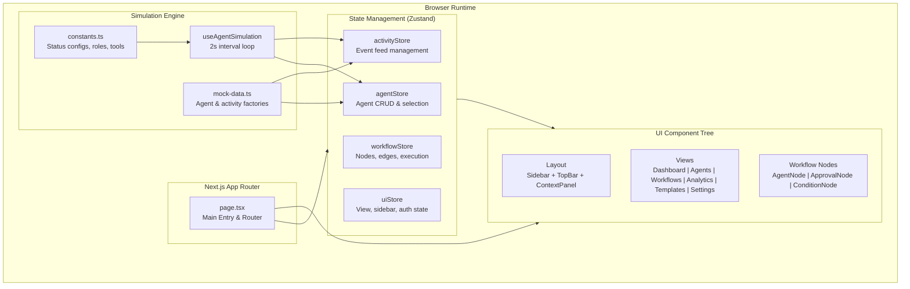
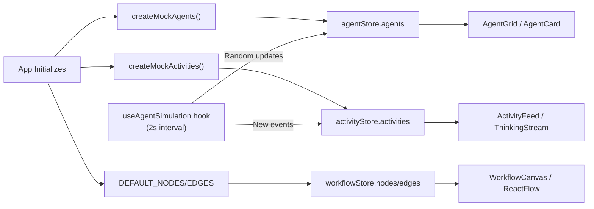
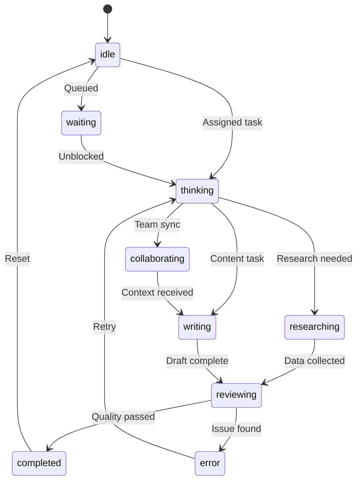
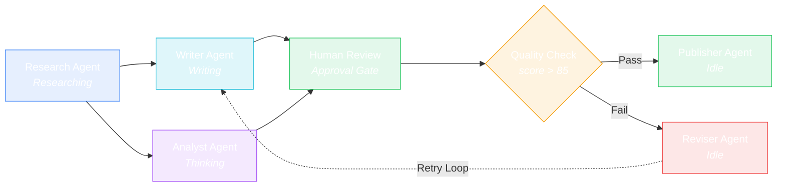
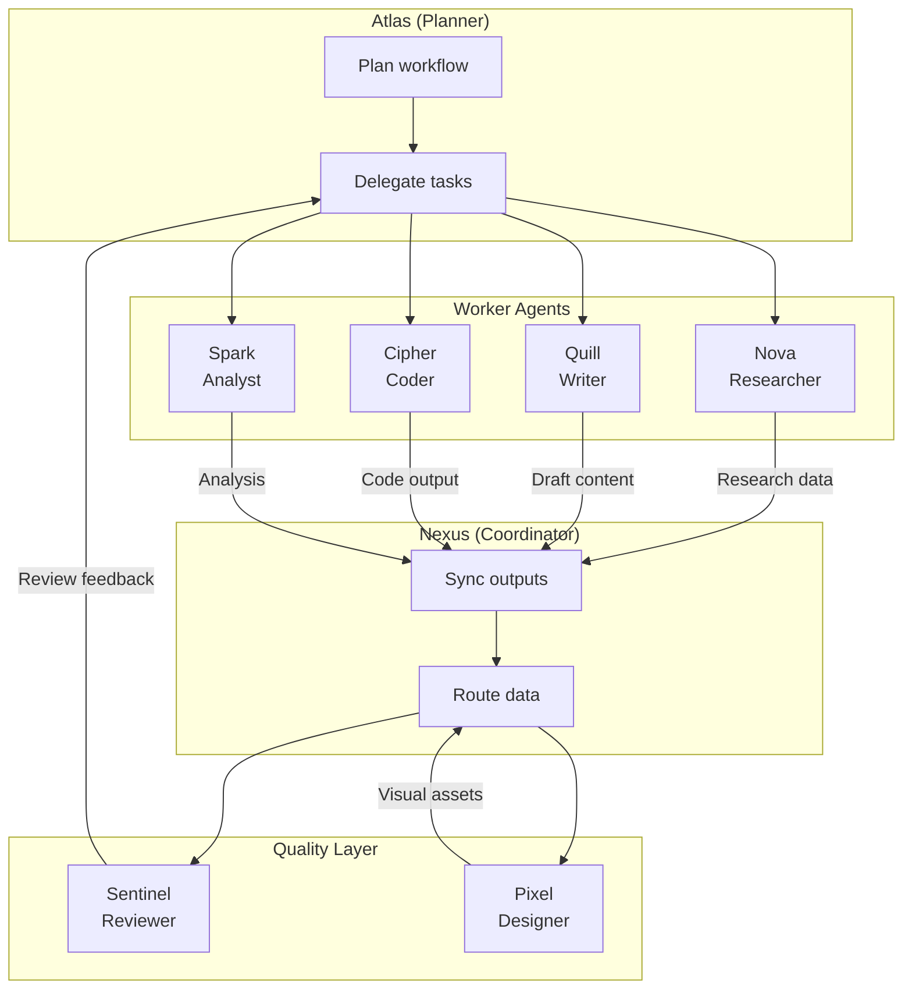
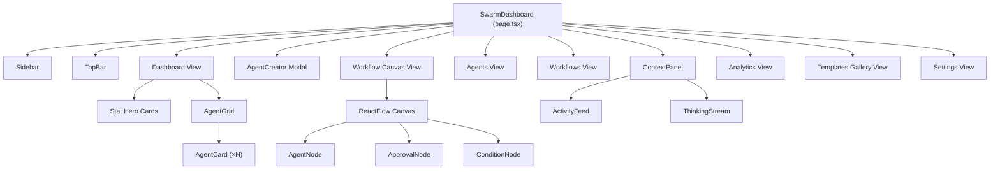

# SynapseFlow — Visual AI Agent Swarm Operating System

> A stunning, real-time visual dashboard for orchestrating multi-agent AI workflows. Built as a Final Year Project (FYP), SynapseFlow lets you create, monitor, and manage swarms of AI agents through a modern, glassmorphic dark-mode UI.

---

## Table of Contents

- [Overview](#overview)
- [AI Agent Codebase Guide](#ai-agent-codebase-guide)
- [Key Features](#key-features)
- [Architecture Overview](#architecture-overview)
- [Agent & Workflow Diagrams](#agent--workflow-diagrams)
- [Tech Stack](#tech-stack)
- [Project Structure](#project-structure)
- [Getting Started](#getting-started)
- [How It Works — Mock Data](#how-it-works-—-mock-data)
- [Switching to Real Data](#switching-to-real-data)
- [Roadmap](#roadmap)
- [License](#license)

---

## Overview

SynapseFlow is a **frontend-only** visual operating system for AI agent swarms. It simulates an entire multi-agent orchestration platform directly in the browser — no backend, no API calls, no external services required.

The application demonstrates:

- **Agent Swarm Management** — Create, configure, and monitor teams of specialized AI agents (Researcher, Writer, Coder, Reviewer, etc.)
- **Visual Workflow Builder** — Drag-and-drop canvas for connecting agents into DAG-based pipelines with conditional branching and human approval gates
- **Real-Time Activity Feed** — Live-updating event stream with per-agent thinking logs, tool calls, and collaboration events
- **Analytics Dashboard** — Task completion charts, token usage tracking, and simulated cost monitoring
- **Template Gallery** — Pre-built swarm configurations for Research, Content Marketing, Engineering, Support, and more

> **Important**: SynapseFlow currently runs entirely on **mock/simulated data**. No actual LLM API calls are made. All agent statuses, token counts, activity events, and analytics are generated client-side via simulation engines. See [Switching to Real Data](#switching-to-real-data) for instructions on connecting to real AI backends.

---

## AI Agent Codebase Guide

For developers or other AI agents looking to understand, debug, or extend this repository, we have compiled an exhaustive technical reference document:

👉 **[CODEBASE_GUIDE.md](CODEBASE_GUIDE.md)**

This guide includes:
- **Project Identity & System Architecture**: Technical flow and client-side execution boundaries.
- **Detailed File-by-File Reference**: Breakdown of every configuration file, entry point, hook, store, and UI component in the codebase.
- **Data Models & Interfaces**: Full TypeScript type details for `Agent`, `ActivityEvent`, and more.
- **State Management Deep Dive**: In-depth explanations of the four Zustand stores and their synchronization behaviors.
- **Simulation Engine & Lifecycle Details**: Mechanics of the 2-second simulation heartbeat and client-side data updates.
- **Styling & Animation Systems**: Insights into the CSS custom properties, glassmorphism tokens, and Framer Motion patterns.
- **Modification & Extension Points**: Step-by-step instructions on how to add new agents, custom node types, backend APIs, or WebSockets.

---

## Key Features

| Feature | Description |
|---|---|
| **Simulated Auth Portal** | Animated login with biometric bypass and multi-step authentication simulation |
| **Agent Swarm Grid** | Cards for each agent showing real-time status, progress, tokens used, active tools, and health |
| **Agent Creator** | Modal to spawn new agents — choose role, personality, LLM model, tools, and capabilities |
| **Workflow Canvas** | React Flow–powered DAG editor with Agent, Approval, and Condition node types |
| **Analytics Dashboard** | Recharts-powered charts for task throughput, token usage, cost tracking |
| **Templates Gallery** | 8 pre-built swarm templates (Research, Content, Support, Coding, SEO, Sales, Social, DevOps) |
| **Live Activity Feed** | Chronological event stream with status icons and agent avatars |
| **Thinking Stream** | Animated reasoning log showing agent "chain-of-thought" steps |
| **Settings Panel** | API key input fields, simulation speed controls, and system safety limits |
| **Dark Glassmorphic UI** | Premium aesthetic with gradient accents, micro-animations, and backdrop blur |

---

## Architecture Overview

SynapseFlow follows a **client-side SPA architecture** with Zustand for global state and React components organized by feature domain.



### Data Flow



---

## Agent & Workflow Diagrams

### Agent Lifecycle States

Each agent cycles through these states, driven by the simulation engine:



### Default Workflow Pipeline

The pre-built workflow canvas demonstrates a content pipeline with conditional branching:



### Swarm Communication Pattern

Shows how agents interact within the system:



### Component Hierarchy



---

## Tech Stack

| Technology | Purpose |
|---|---|
| **Next.js 16** (App Router) | React framework with server components and file-based routing |
| **React 19** | UI library |
| **TypeScript** | Type-safe development |
| **Zustand** | Lightweight global state management (4 stores) |
| **@xyflow/react** (React Flow) | Interactive node-based workflow canvas |
| **Framer Motion** | Animations and transitions |
| **Recharts** | Data visualization charts |
| **TailwindCSS 4** | Utility-first CSS framework |
| **Lucide React** | Icon library |
| **clsx + tailwind-merge** | Conditional class name composition |

---

## Project Structure

```
synapse-flow/
├── src/
│   ├── app/
│   │   ├── page.tsx              # Main entry: auth gate, view router, dashboard
│   │   ├── layout.tsx            # Root layout with fonts and metadata
│   │   └── globals.css           # Design system: CSS vars, glassmorphism, animations
│   │
│   ├── components/
│   │   ├── agents/
│   │   │   ├── AgentCard.tsx     # Individual agent card with live status/progress
│   │   │   ├── AgentCreator.tsx  # Modal for spawning new agents
│   │   │   └── AgentGrid.tsx    # Filterable grid of all agents
│   │   │
│   │   ├── workflow/
│   │   │   ├── WorkflowCanvas.tsx  # React Flow canvas with toolbar
│   │   │   ├── WorkflowsList.tsx   # Workflow manager/list view
│   │   │   └── nodes/
│   │   │       ├── AgentNode.tsx     # Custom agent node for canvas
│   │   │       ├── ApprovalNode.tsx  # Human approval gate node
│   │   │       └── ConditionNode.tsx # Conditional branching node
│   │   │
│   │   ├── activity/
│   │   │   ├── ActivityFeed.tsx    # Live event stream
│   │   │   └── ThinkingStream.tsx  # Agent reasoning log
│   │   │
│   │   ├── analytics/
│   │   │   └── AnalyticsDashboard.tsx  # Charts and statistics
│   │   │
│   │   ├── templates/
│   │   │   └── TemplatesGallery.tsx  # Pre-built swarm templates
│   │   │
│   │   └── layout/
│   │       ├── Sidebar.tsx       # Collapsible nav sidebar
│   │       ├── TopBar.tsx        # Search, notifications, system status
│   │       └── ContextPanel.tsx  # Right panel: activity feed + agent details
│   │
│   ├── stores/                   # Zustand state management
│   │   ├── agentStore.ts         # Agent CRUD, selection, initialization
│   │   ├── workflowStore.ts      # Workflow nodes, edges, execution state
│   │   ├── activityStore.ts      # Activity event feed
│   │   └── uiStore.ts            # Sidebar, views, auth, notifications
│   │
│   ├── hooks/
│   │   └── useAgentSimulation.ts # Client-side simulation engine (2s loop)
│   │
│   └── lib/
│       ├── mock-data.ts          # Mock agent/activity data factories
│       ├── constants.ts          # Status configs, roles, tools, templates
│       └── utils.ts              # Helpers: formatting, random, ID generation
│
├── package.json
├── tsconfig.json
├── next.config.ts
└── plan.md                       # Development plan & phase tracker
```

---

## Getting Started

### Prerequisites

- **Node.js** ≥ 18.x
- **npm** ≥ 9.x (or yarn / pnpm / bun)

### Installation

1. **Clone the repository**
   ```bash
   git clone https://github.com/your-username/SynapseFlow.git
   cd SynapseFlow/synapse-flow
   ```

2. **Install dependencies**
   ```bash
   npm install
   ```

3. **Run the development server**
   ```bash
   npm run dev
   ```

4. **Open in browser**
   Navigate to [http://localhost:3000](http://localhost:3000)

5. **Log in** using the demo credentials displayed on the login screen:
   - **Email:** `admin@synapseflow.ai`
   - **Password:** `password123`
   - Or click **"Simulate Fingerprint Biometrics"** for instant access

### Build for Production

```bash
npm run build
npm start
```

---

## How It Works — Mock Data

SynapseFlow is currently a **frontend prototype** that simulates all backend behavior client-side. Here's exactly what is mocked and how:

### 1. Mock Agents (`src/lib/mock-data.ts`)

The function `createMockAgents()` returns 8 hardcoded agents with pre-set properties:

| Agent | Role | Model | Initial Status |
|---|---|---|---|
| Atlas | Planner | GPT-4o | Thinking |
| Nova | Researcher | Claude Sonnet | Researching |
| Quill | Writer | GPT-4o | Writing |
| Sentinel | Reviewer | Gemini Pro | Reviewing |
| Pixel | Designer | DALL-E 3 | Idle |
| Cipher | Coder | Claude Sonnet | Thinking |
| Nexus | Coordinator | GPT-4o Mini | Collaborating |
| Spark | Analyst | Gemini Pro | Completed |

Each agent has fields for `tokensUsed`, `progress`, `activeTools`, `lastOutput`, `health`, `memory`, `personality`, and `goal` — all statically defined.

### 2. Simulation Engine (`src/hooks/useAgentSimulation.ts`)

A `setInterval` loop runs every **2 seconds** and randomly:
- **Changes agent status** (30% chance) — picks a random agent and assigns a new random status
- **Updates progress** (30% chance) — increments progress by 1–8%, auto-completes at 100%
- **Increments tokens** (20% chance) — adds 50–500 tokens for active agents
- **Generates tool call events** (20% chance) — adds fake "Calling Web Search API..." events

### 3. Mock Activities (`src/lib/mock-data.ts`)

`createMockActivities()` generates 14 pre-scripted activity events with fixed timestamps, simulating a realistic event history.

### 4. Mock Workflow (`src/stores/workflowStore.ts`)

The default workflow is hardcoded with 7 nodes and 8 edges representing a content pipeline. Nodes can be dragged and reconnected, but execution is visual-only (no actual task processing occurs).

### 5. Mock Authentication (`src/app/page.tsx`)

Login accepts **any** credentials. The "authentication" is a `useState` toggle with animated loading steps (`"Establishing neural connection..."`, etc.). No tokens, sessions, or server validation exist.

### 6. Mock Analytics

All charts display randomly generated or computed values based on current agent state (e.g., total tokens = sum of all agent `tokensUsed`).

---

## Switching to Real Data

To evolve SynapseFlow from a prototype into a production system, you need to replace the mock data layer with real backend integrations. Below is a step-by-step guide:

### Step 1: Add a Backend API

Create a backend service (e.g., Node.js/Express, Python/FastAPI, or a serverless solution) that:
- Manages agent state in a database (PostgreSQL, MongoDB, etc.)
- Proxies LLM API calls to OpenAI, Anthropic, Google, etc.
- Handles authentication (JWT, OAuth, etc.)
- Exposes REST or GraphQL endpoints

### Step 2: Replace the Agent Store

**Current (mock):**
```typescript
// src/stores/agentStore.ts
initializeAgents: () => {
  const agents = createMockAgents(); // ← hardcoded data
  set({ agents });
},
```

**Real implementation:**
```typescript
// src/stores/agentStore.ts
initializeAgents: async () => {
  const response = await fetch('/api/agents');
  const agents = await response.json();
  set({ agents });
},
```

### Step 3: Replace the Simulation Engine with WebSockets

**Current (mock):**
```typescript
// src/hooks/useAgentSimulation.ts
setInterval(() => {
  // Random status changes every 2s
}, 2000);
```

**Real implementation:**
```typescript
// src/hooks/useAgentUpdates.ts
useEffect(() => {
  const ws = new WebSocket('wss://your-api.com/agents/stream');
  ws.onmessage = (event) => {
    const update = JSON.parse(event.data);
    updateAgent(update.agentId, update.changes);
    addActivity(update.activityEvent);
  };
  return () => ws.close();
}, []);
```

### Step 4: Wire Up Real LLM Calls

**Current:** The Settings page has API key fields that are stored in `useState` and never used.

**Real implementation:**
1. Send API keys to your backend securely (never call LLM APIs directly from the frontend)
2. Backend stores keys encrypted and uses them when executing agent tasks
3. Agent task execution flow:
   ```
   Frontend → POST /api/workflows/execute
   Backend  → Orchestrate agents → Call OpenAI/Anthropic/Google APIs
   Backend  → Stream results via WebSocket → Frontend updates in real-time
   ```

### Step 5: Replace Mock Authentication

**Current:** Any email/password combo works — it's a `useState` boolean.

**Real implementation:**
```typescript
const handleLogin = async (e: React.FormEvent) => {
  e.preventDefault();
  const res = await fetch('/api/auth/login', {
    method: 'POST',
    body: JSON.stringify({ email: loginEmail, password: loginPassword }),
  });
  if (res.ok) {
    const { token } = await res.json();
    localStorage.setItem('token', token);
    setAuthenticated(true);
  }
};
```

### Step 6: Persist Workflows

**Current:** Workflows reset to defaults on page refresh.

**Real implementation:**
- Save workflow graph (nodes + edges) to a database via API
- Load saved workflows on initialization
- Support multiple saved workflows per user

### Summary of Files to Modify

| File | What to Change |
|---|---|
| `src/lib/mock-data.ts` | Replace with API service calls or delete entirely |
| `src/hooks/useAgentSimulation.ts` | Replace with WebSocket hook for real-time updates |
| `src/stores/agentStore.ts` | Add async `fetch` calls for agent CRUD |
| `src/stores/activityStore.ts` | Connect to real event stream |
| `src/stores/workflowStore.ts` | Add persistence (save/load via API) |
| `src/app/page.tsx` | Wire login to real auth endpoint; store JWT |
| `src/stores/uiStore.ts` | Persist preferences to user profile |
| **(New)** `src/lib/api.ts` | Create API client with base URL, auth headers, error handling |
| **(New)** `src/hooks/useWebSocket.ts` | Generic WebSocket hook for real-time agent/activity streams |

---

## Roadmap

### Phase 1 — MVP (Complete)
- Project scaffolding, design system, layout
- Agent swarm manager with simulation
- Workflow canvas with custom nodes
- Activity feed and thinking stream
- Analytics dashboard
- Templates gallery
- Auth portal (simulated)
- Polish: animations, scrollbars, production build

### Phase 2 (Planned)
- [ ] Real-time collaboration (multi-user)
- [ ] Natural language workflow generation
- [ ] Real backend with WebSocket integration
- [ ] Advanced analytics with historical data

### Phase 3 (Future)
- [ ] Swarm plugin marketplace
- [ ] Autonomous AI supervisor agent
- [ ] Voice interaction commands

---

## License

This project was built as a **Final Year Project (FYP)**. Please check with the repository owner for license terms.

---

<p align="center">
  Built by SynapseFlow Team
</p>
